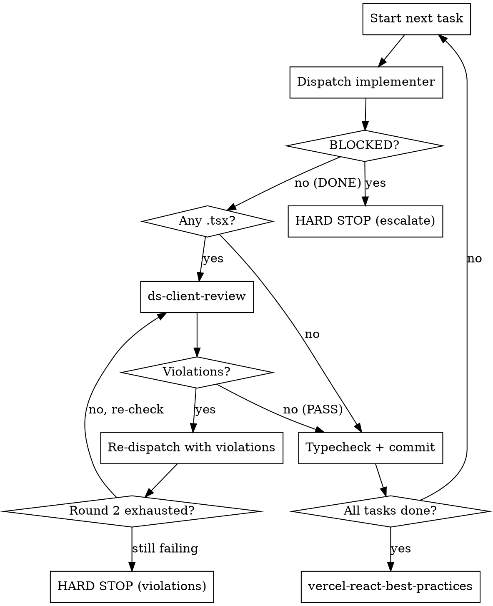
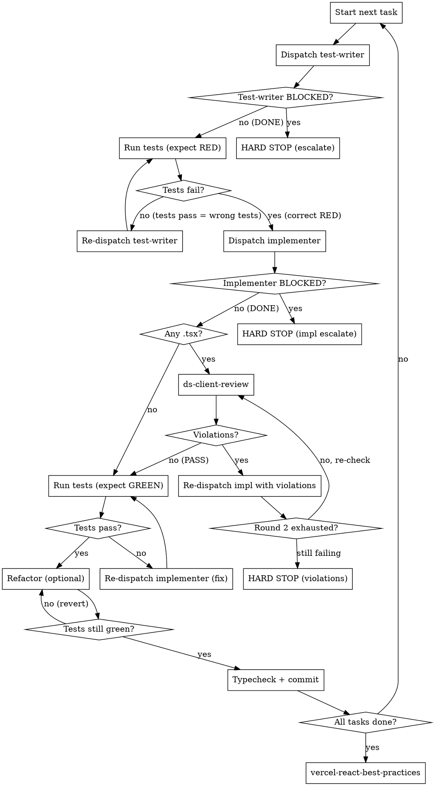

# DS Client Constrained Execution

## Overview

Drives task-by-task execution of client migration plans. Two modes based on each task's tag:

- **`[NO-TDD]`**: implementer → ds-client-review → typecheck → commit
- **`[TDD]`**: test-writer (red) → verify fail → implementer (green) → ds-client-review → verify pass → refactor → typecheck → commit

The main session only orchestrates, reviews, typechecks, and commits. Implementation and test-writing are dispatched to subagents.

## Mode Detection

Read the task's tag from `plan.md`. Every task is marked `[TDD]` or `[NO-TDD]` at audit time. This is not agent discretion — follow the tag.

## Detecting `.tsx` tasks

Look at each task's `**Files:**` section in the plan — not `git status`. A task has `.tsx` changes if any `Create:` or `Modify:` entry ends in `.tsx`.

## `[NO-TDD]` Execution Loop



## `[TDD]` Execution Loop



## Implementer Subagent

Use the template in `implementer-template.md` (same directory as this skill). Key rules:
- Paste the **full task text** from the plan inline — do not make the subagent read the plan file
- Read `docs/DS_CLIENT_USAGE.md` and paste its full contents into the placeholder
- The implementer does **Step 1 only** (implement all files for the task) — never typecheck or commit
- In `[TDD]` mode: the implementer writes **minimal code to pass the tests** — nothing more
- For revisions: include the full ds-client-review violation report in the prompt
- If implementer returns BLOCKED or NEEDS_CONTEXT → hard stop, surface to user

## Test-Writer Subagent (`[TDD]` mode only)

Use the template in `test-writer-template.md` (same directory as this skill). Key rules:
- Paste the **full task text** from the plan inline
- The test-writer writes **failing tests only** — zero production code
- Tests must fail because the feature is missing, not because of typos or import errors
- After dispatch, run the tests yourself and verify they fail (RED phase)
- If tests pass immediately → the tests are wrong. Re-dispatch the test-writer.

## DS Client Review

After Step 1 of any task that touches `.tsx`, invoke the `ds-client-review` agent using the Agent tool.

**What to pass in the agent prompt:**
1. The full content of each changed `.tsx` file (paste inline)
2. The full content of `docs/DS_CLIENT_USAGE.md` (paste inline)
3. Instruction: return structured violations per the agent's output format

**Expected output — violations:**
```
VIOLATION 1
File: src/features/jobs/JobCard.tsx:12
Rule: "Never: Import from `react-icons` — fully replaced by the DS icon system."
Violation: `import { FiBriefcase } from 'react-icons/fi'` imports from react-icons.
Fix: Replace with `<Icon name="briefcase" />` from `@umichkisa-ds/web`.

---
Result: 1 violation(s), 0 warning(s) found
```

**Expected output — clean pass:**
```
---
Result: PASS — no violations found
```

## Hard Stop

When violations remain after 2 revision rounds:

1. Print: `DS CLIENT REVIEW HARD STOP — unresolved violations after 2 rounds`
2. List every remaining violation with file:line, exact quoted rule, and suggested fix
3. Stop. Do not move to the next task.
4. Ask:
   > How would you like to proceed?
   > (a) Clarify or relax the constraint in DS_CLIENT_USAGE.md
   > (b) Adjust the spec / approach for this task
   > (c) Attempt one more round with new direction from you

Wait for explicit instruction before continuing.

## Final Review

After all tasks pass DS client review, invoke the `vercel-react-best-practices` skill for a final code quality pass. Then proceed to the plan's session-end checklist.

## Common Mistakes

- **Using git status to detect .tsx changes** — always use the task's `Files:` section instead
- **Running typecheck before DS client review** — DS client review must pass first; typecheck comes after
- **Skipping review on mixed tasks** — if a task touches both `.md` and `.tsx`, the `.tsx` always triggers the review cycle
- **Batching tasks** — review each task independently; do not accumulate changes across tasks before reviewing
- **Treating round 2 as soft** — after round 2 with violations still present, hard stop is mandatory, not optional
- **Summarizing violations** — always quote the exact rule text from DS_CLIENT_USAGE.md, never paraphrase
- **Wrong mode** — follow the task's `[TDD]`/`[NO-TDD]` tag exactly. Do not switch modes based on task complexity or your judgment
- **Skipping RED verification in TDD mode** — you MUST run the tests yourself and see them fail before dispatching the implementer. No exceptions.
- **Implementer writing tests in TDD mode** — the implementer writes production code only. Tests come from the test-writer subagent.
