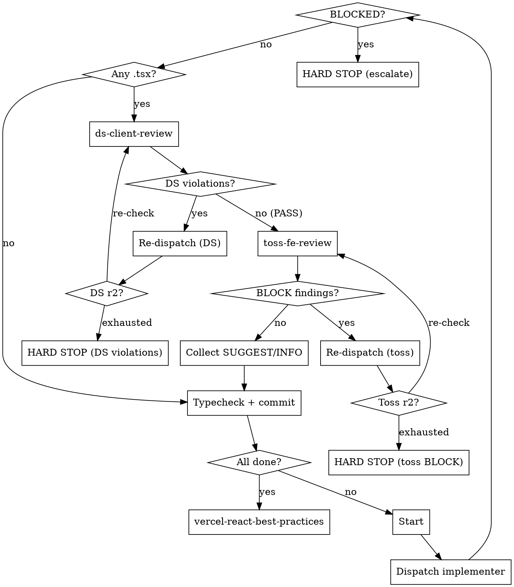
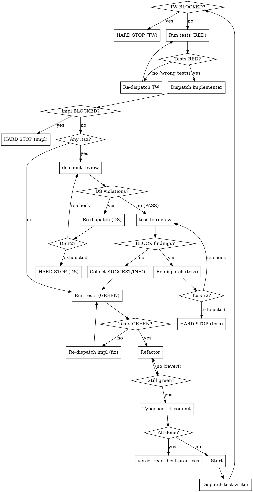

# DS Client Constrained Execution

## Overview

Drives task-by-task execution of client migration plans. Two modes based on each task's `[TDD]`/`[NO-TDD]` tag in `plan.md` (not agent discretion — follow the tag):

- **`[NO-TDD]`**: implementer → ds-client-review → toss-fe-review → typecheck → commit
- **`[TDD]`**: test-writer (red) → verify fail → implementer (green) → ds-client-review → toss-fe-review → verify pass → refactor → typecheck → commit

The main session only orchestrates, reviews, typechecks, and commits. Implementation and test-writing are dispatched to subagents.

## Execution context

This skill runs in two modes; the **invoker declares** which (no auto-detection):

- **Live (default)** — interactive Mode D session at the keyboard. On unresolved BLOCKs after exhausted rounds, the orchestrator **stops and asks** the user how to proceed (the (a)/(b)/(c)/(d) prompts in each gate's "Hard stop" block).
- **Autonomous** — nightly routine in a cloud VM (per `AUTONOMOUS_PROTOCOL.md` §6 Bailout). On unresolved BLOCKs, **never block the run.** Instead: convert the PR to draft, add `needs-decision` label, post a structured comment with the unresolved findings, append a one-liner to `notes.md`, and **move on to the next eligible lane.**

The Toss FE Review and Final Review sections below each have an **Autonomous override** subsection. Honor it whenever the invoker has declared autonomous mode. DS-violation hard stop (in ds-client-review) follows the same override: bailout-to-draft instead of stop-and-ask.

## Redesign over Preserve

Client migration is **redesign + migration**, not mechanical retokenization. When the original UI conflicts with `DS_CLIENT_USAGE.md`, the executor **must pick the DS-canonical choice**, not preserve the original value.

Examples: `md:space-x-8` nav strip → ship Component-tier `space-x-4`; `rounded-lg` button → ship `rounded-md`; `text-gray-600` helper caption → ship `text-muted-foreground`.

**Visibility rule — `text-muted-foreground` is NOT a default body color.** Reserve it for genuinely secondary content (captions, helper text, metadata, timestamps). Anything the user needs to read stays `text-foreground`. Test: if this text went to 40% opacity, would the screen still be usable? If no → primary, keep `text-foreground`.

Implementer must record every such choice in the PR body under a `## Deviations from original` bullet list, so the reviewer can verify the DS reasoning (not just the rename).

Only brand identity is preserved unconditionally: navy + maize colors, Korean + English type pairing, page structure, signature moves. Everything else defers to DS.

**This applies at write time, not review time.** The implementer shouldn't ship off-tier values expecting the reviewer to catch them — every spacing, color, radius, and typography value should be tier-justified before the file is written.

## `[NO-TDD]` Execution Loop

Detect `.tsx` changes from the task's `**Files:**` section in the plan (not `git status`) — any `Create:`/`Modify:` entry ending in `.tsx` triggers the review chain.

```dot
digraph no_tdd {
  node [shape=box];
  "BLOCKED?" [shape=diamond]; "Any .tsx?" [shape=diamond]; "DS violations?" [shape=diamond]; "DS r2?" [shape=diamond]; "BLOCK findings?" [shape=diamond]; "Toss r2?" [shape=diamond]; "All done?" [shape=diamond];

  "Start" -> "Dispatch implementer" -> "BLOCKED?";
  "BLOCKED?" -> "HARD STOP (escalate)" [label="yes"];
  "BLOCKED?" -> "Any .tsx?" [label="no"];
  "Any .tsx?" -> "ds-client-review" [label="yes"];
  "Any .tsx?" -> "Typecheck + commit" [label="no"];
  "ds-client-review" -> "DS violations?";
  "DS violations?" -> "toss-fe-review" [label="no (PASS)"];
  "DS violations?" -> "Re-dispatch (DS)" [label="yes"];
  "Re-dispatch (DS)" -> "DS r2?";
  "DS r2?" -> "HARD STOP (DS violations)" [label="exhausted"];
  "DS r2?" -> "ds-client-review" [label="re-check"];
  "toss-fe-review" -> "BLOCK findings?";
  "BLOCK findings?" -> "Collect SUGGEST/INFO" [label="no"];
  "BLOCK findings?" -> "Re-dispatch (toss)" [label="yes"];
  "Re-dispatch (toss)" -> "Toss r2?";
  "Toss r2?" -> "HARD STOP (toss BLOCK)" [label="exhausted"];
  "Toss r2?" -> "toss-fe-review" [label="re-check"];
  "Collect SUGGEST/INFO" -> "Typecheck + commit" -> "All done?";
  "All done?" -> "vercel-react-best-practices" [label="yes"];
  "All done?" -> "Start" [label="no"];
}
```

## `[TDD]` Execution Loop

Same review chain, sandwiched between RED and GREEN test phases.

```dot
digraph tdd {
  node [shape=box];
  "TW BLOCKED?" [shape=diamond]; "Tests RED?" [shape=diamond]; "Impl BLOCKED?" [shape=diamond]; "Any .tsx?" [shape=diamond]; "DS violations?" [shape=diamond]; "DS r2?" [shape=diamond]; "BLOCK findings?" [shape=diamond]; "Toss r2?" [shape=diamond]; "Tests GREEN?" [shape=diamond]; "Still green?" [shape=diamond]; "All done?" [shape=diamond];

  "Start" -> "Dispatch test-writer" -> "TW BLOCKED?";
  "TW BLOCKED?" -> "HARD STOP (TW)" [label="yes"];
  "TW BLOCKED?" -> "Run tests (RED)" [label="no"];
  "Run tests (RED)" -> "Tests RED?";
  "Tests RED?" -> "Dispatch implementer" [label="yes"];
  "Tests RED?" -> "Re-dispatch TW" [label="no (wrong tests)"];
  "Re-dispatch TW" -> "Run tests (RED)";
  "Dispatch implementer" -> "Impl BLOCKED?";
  "Impl BLOCKED?" -> "HARD STOP (impl)" [label="yes"];
  "Impl BLOCKED?" -> "Any .tsx?" [label="no"];
  "Any .tsx?" -> "ds-client-review" [label="yes"];
  "Any .tsx?" -> "Run tests (GREEN)" [label="no"];
  "ds-client-review" -> "DS violations?";
  "DS violations?" -> "toss-fe-review" [label="no (PASS)"];
  "DS violations?" -> "Re-dispatch (DS)" [label="yes"];
  "Re-dispatch (DS)" -> "DS r2?";
  "DS r2?" -> "HARD STOP (DS)" [label="exhausted"];
  "DS r2?" -> "ds-client-review" [label="re-check"];
  "toss-fe-review" -> "BLOCK findings?";
  "BLOCK findings?" -> "Collect SUGGEST/INFO" [label="no"];
  "BLOCK findings?" -> "Re-dispatch (toss)" [label="yes"];
  "Re-dispatch (toss)" -> "Toss r2?";
  "Toss r2?" -> "HARD STOP (toss)" [label="exhausted"];
  "Toss r2?" -> "toss-fe-review" [label="re-check"];
  "Collect SUGGEST/INFO" -> "Run tests (GREEN)" -> "Tests GREEN?";
  "Tests GREEN?" -> "Refactor" [label="yes"];
  "Tests GREEN?" -> "Re-dispatch impl (fix)" [label="no"];
  "Re-dispatch impl (fix)" -> "Run tests (GREEN)";
  "Refactor" -> "Still green?";
  "Still green?" -> "Typecheck + commit" [label="yes"];
  "Still green?" -> "Refactor" [label="no (revert)"];
  "Typecheck + commit" -> "All done?";
  "All done?" -> "vercel-react-best-practices" [label="yes"];
  "All done?" -> "Start" [label="no"];
}
```

## Subagent Templates

Use `implementer-template.md` and `test-writer-template.md` (same directory). Critical rules:
- Paste the **full task text** from the plan inline — do NOT make the subagent read the plan file
- Implementer does Step 1 only (write files); test-writer writes failing tests only (zero production code)

## DS Client Review

After Step 1 of any task that touches `.tsx`, invoke the `ds-client-review` agent. Pass: each changed `.tsx` file inline + instruction to return structured violations. The agent reads `docs/DS_CLIENT_USAGE.md` itself — do not paste it inline.

Output: structured `VIOLATION N / File / Rule / Violation / Fix` blocks ending with `Result: N violation(s)...`, or `Result: PASS — no violations found` on clean.

**Hard stop on violations after 2 rounds:** print `DS CLIENT REVIEW HARD STOP — unresolved violations after 2 rounds`, list every remaining violation (file:line + quoted rule + fix), stop, and ask:
> (a) Clarify/relax the constraint in DS_CLIENT_USAGE.md (b) Adjust the spec/approach (c) One more round with new direction (d) DS bug — invoke `ds-fix-during-migration`, then resume

Wait for explicit instruction.

**Autonomous override:** open the PR as **draft**, add label `needs-decision`, post a comment headed `## DS Client Review — unresolved violations after 2 rounds` with each `file:line + quoted rule + fix`, append a one-liner to the phase's `notes.md`, then move on to the next eligible lane. Do not stop the run.

## Toss FE Review

After ds-client-review passes (no violations), and before typecheck (NO-TDD) or tests-green-verify (TDD), invoke the `toss-fe-review` agent. Pass: each changed `.tsx` file inline, optionally adjacent files for context (parents, hook callers, siblings) when referenced non-trivially, and instruction to return structured findings. The agent reads its own rubric — do not paste rules inline.

**Severity gate (orchestrator behavior):**
- **BLOCK** finding(s) → re-dispatch implementer with the findings; same 2-round hard-stop rule as ds-client-review
- **SUGGEST** / **INFO** → collect for the PR body's `## Toss FE notes` section; do NOT re-dispatch

**Hard stop on toss BLOCK after 2 rounds:** print `TOSS FE REVIEW HARD STOP — unresolved BLOCK findings after 2 rounds`, list remaining BLOCKs, stop, and ask:
> (a) Downgrade BLOCK → SUGGEST and move on (b) Adjust task scope — break refactor into its own lane (c) One more round with new direction (d) Override — accept and ship

Wait for explicit instruction.

**Autonomous override:** open the PR as **draft**, add label `needs-decision`, post a comment headed `## Toss FE — unresolved BLOCK after 2 rounds` with each remaining BLOCK (file:line + finding + suggested fix), append a one-liner to the phase's `notes.md`, then move on to the next eligible lane. Do not stop the run.

**SUGGEST / INFO collection:** Append SUGGEST findings to a `## Toss FE notes` section in the PR body under each lane's commit. INFO findings are not surfaced. (Autonomous mode unchanged — these never block.)

## Final Review

After all tasks pass both review gates, invoke the `vercel-react-best-practices` skill for a final code quality pass.

**Severity contract** (mirrors Toss):
- BLOCK-equivalent findings → live: stop and ask the user; autonomous: see override below
- SUGGEST/INFO → append to `## Final review notes` section in the PR body; do NOT re-dispatch

**Autonomous override:** if the final review surfaces BLOCK-equivalent findings, open the PR as **draft**, add label `needs-decision`, post a comment headed `## Final Review (vercel-react-best-practices) — flagged` with each finding (file:line + issue + suggested fix), append a one-liner to the phase's `notes.md`, then move on to the next eligible lane. Do not stop the run.

Then proceed to the plan's session-end checklist.

## Common Mistakes

- **Using git status to detect .tsx changes** — always use the task's `Files:` section
- **Wrong mode** — follow the task's `[TDD]`/`[NO-TDD]` tag exactly; never switch based on judgment
- **Skipping RED verification in TDD mode** — run tests yourself and see them fail before dispatching the implementer
- **Summarizing violations** — quote the exact rule text from DS_CLIENT_USAGE.md, never paraphrase
