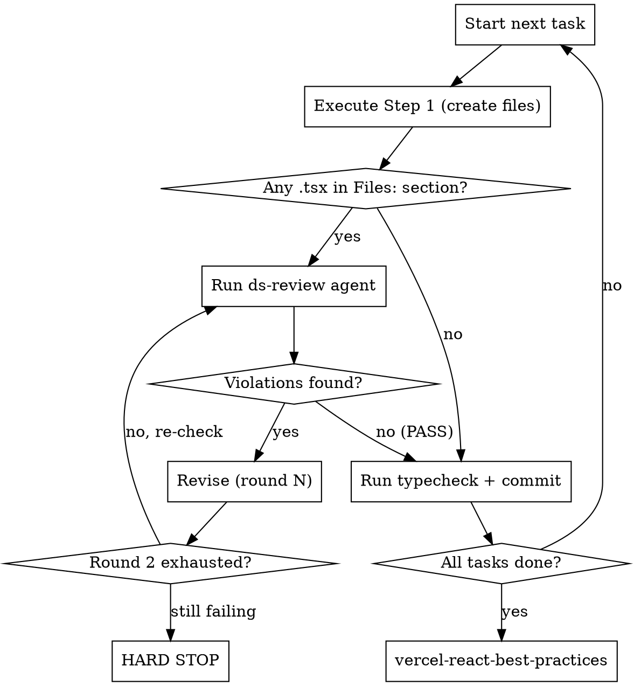

# DS-Constrained Execution

## Overview

This skill is the KISA DS replacement for `superpowers:executing-plans`. When a plan says `REQUIRED SUB-SKILL: Use superpowers:executing-plans`, ignore it — use this skill instead.

Drives task-by-task execution with automatic DS constraint review after the file creation step of every task that touches `.tsx` files. Catches token violations, typography rule breaks, and accessibility errors before they compound.

## Detecting `.tsx` tasks

Look at each task's `**Files:**` section in the plan — not `git status`. A task has `.tsx` changes if any `Create:` or `Modify:` entry ends in `.tsx`. This is the authoritative source.

Example:
```
**Files:**
- Create: apps/docs/components/ComponentPreview.tsx   ← .tsx → triggers review
- Create: apps/docs/content/_components_to_switch.md  ← .md only → no review
```

## Intra-task step order

Every plan task follows this structure: file creation → typecheck → commit.
The DS review fits **between file creation and typecheck**:

```
Step 1: Create the file(s)
        ↓
        [DS review — only if .tsx was created/modified]
        ↓ (revise if needed, 2 rounds max)
Step 2: Run typecheck  ← only after DS review passes
Step 3: Commit
```

Never run typecheck or commit before DS review has passed for that task.

## The Execution Loop



## DS Review Subagent

After Step 1 of any task that touches `.tsx`, invoke the `ds-review` agent using the Agent tool.

**What to pass in the agent prompt:**
1. The full content of each changed `.tsx` file (paste inline)
2. The full content of `docs/DS_CONSTRAINTS.md` (paste inline)
3. Instruction: return structured violations per the format below

**Expected output — violations:**
```
VIOLATION 1
File: apps/docs/components/ComponentPreview.tsx:12
Rule: "Must: Use semantic tokens (`--color-*`) in all component CSS — never raw hex, raw OKLCH values, or primitive tokens."
Violation: `bg-blue-500` is a raw Tailwind color, not a semantic token.
Fix: Replace with `bg-surface` or the appropriate semantic token class.

---
Result: 1 violation found
```

**Expected output — clean pass:**
```
---
Result: PASS — no violations found
```

## Hard Stop

When violations remain after 2 revision rounds:

1. Print: `DS REVIEW HARD STOP — unresolved violations after 2 rounds`
2. List every remaining violation with file:line, exact quoted rule, and suggested fix
3. Stop. Do not move to the next task.
4. Ask:
   > How would you like to proceed?
   > (a) Clarify or relax the constraint in DS_CONSTRAINTS.md
   > (b) Adjust the spec / approach for this task
   > (c) Attempt one more round with new direction from you

Wait for explicit instruction before continuing.

## Final Review

After all tasks pass DS review, invoke the `vercel-react-best-practices` skill for a final code quality pass. Then proceed to the spec's session-end checklist.

## Common Mistakes

- **Using git status to detect .tsx changes** — always use the task's `Files:` section instead
- **Running typecheck before DS review** — DS review must pass first; typecheck comes after
- **Skipping review on mixed tasks** — if a task touches both `.md` and `.tsx`, the `.tsx` always triggers the review cycle
- **Batching tasks** — review each task independently; do not accumulate changes across tasks before reviewing
- **Treating round 2 as soft** — after round 2 with violations still present, hard stop is mandatory, not optional
- **Summarizing violations** — always quote the exact rule text from DS_CONSTRAINTS.md, never paraphrase
