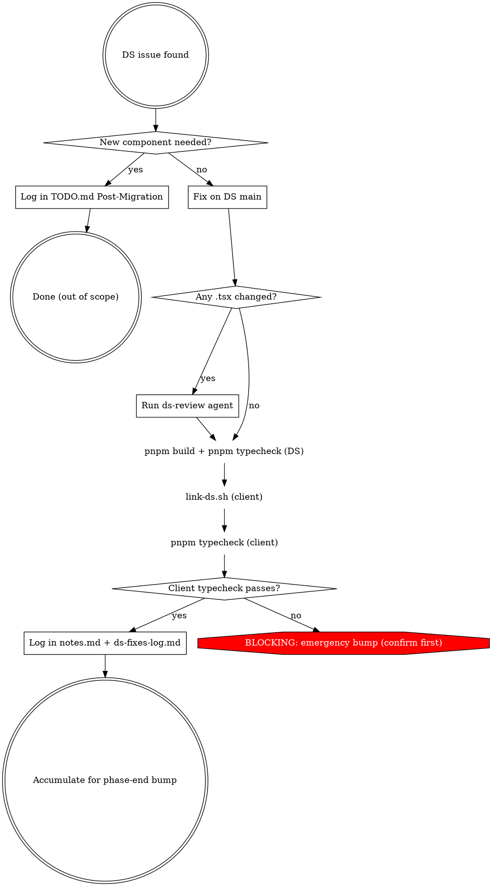

# DS Fix During Migration

## Overview

Pause client work, fix DS on `main`, verify via symlink, log for phase-end bump, resume. Keeps fixes minimal — bug fixes and gap fills only, no feature additions.

## Scope Check

## Fix Rules

- **Minimal fix only.** Fix the bug or fill the gap — do not add features, refactor neighbors, or improve unrelated code.
- **Direct on `main`.** No worktree. These are small, targeted patches.
- **ds-review gates `.tsx`.** If the fix touches any `.tsx` file, run the `ds-review` agent against it before building. Same rules as `ds-constrained-execution`.

## Verification Chain (all three, in order)

1. `pnpm build` in DS repo — produces new dist
2. `../KISA-website/client/scripts/link-ds.sh` — symlinks new dist into client
3. `pnpm typecheck` in client repo — confirms the fix resolves the original issue

Do NOT skip any step. Do NOT assume the symlink is already in place — always re-run `link-ds.sh`.

## Dual Logging

After verification passes, log in **both** places:

1. **Subphase `notes.md`** — append: `DS FIX: <description> (commit <SHA>)`
2. **`docs/plans/client-migration/ds-fixes-log.md`** — append under the correct package section: `- **[Phase N.M]** <description> (commit SHA)`

## Blocking Detection

If the client **cannot typecheck even with the symlink** (e.g., the fix requires a new dependency, or the type definitions are structurally incompatible), the fix is **blocking** — it cannot wait for phase-end.

For a blocking fix:
1. Ask the user for confirmation before proceeding
2. Follow `ds-phase-end-bump` steps 2–7 for the affected package only
3. Log with `(BLOCKING)` tag in both notes.md and ds-fixes-log.md

## Resume

After the fix is complete and logged:
1. Re-read the current subphase's `plan.md`
2. Find the task that was blocked
3. Report: "Resume at **Task N: <task title>** — re-dispatch implementer"

## Common Mistakes

- Fixing a new component instead of logging it in TODO.md Post-Migration
- Adding features beyond the minimal fix (scope creep)
- Skipping `link-ds.sh` — always re-run it, even if you think the symlink exists
- Logging in only one place — both `notes.md` AND `ds-fixes-log.md` are required
- Running emergency bump without user confirmation
- Not providing the exact resume task after the fix
