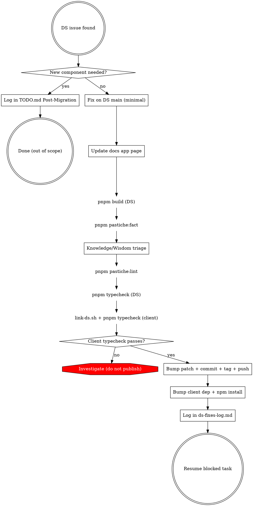

# DS Fix During Migration

## Overview

Pause client work, fix DS on `main`, update docs app, regen pastiche FACT, publish a patch immediately, sync client, resume. Keeps fixes minimal — bug fixes and gap fills only, no feature additions.

Mid-phase fixes publish immediately as a patch bump (per `feedback_mid_phase_bump_default`); they do not accumulate for phase-end.

## Scope Check


```dot
digraph scope {
  "DS issue found" [shape=doublecircle];
  "New component needed?" [shape=diamond];
  "Log in TODO.md Post-Migration" [shape=box];
  "Done (out of scope)" [shape=doublecircle];
  "Fix on DS main (minimal)" [shape=box];
  "Update docs app page" [shape=box];
  "pnpm build (DS)" [shape=plaintext];
  "pnpm pastiche:fact" [shape=plaintext];
  "Knowledge/Wisdom triage" [shape=box];
  "pnpm pastiche:lint" [shape=plaintext];
  "pnpm typecheck (DS)" [shape=plaintext];
  "link-ds.sh + pnpm typecheck (client)" [shape=plaintext];
  "Client typecheck passes?" [shape=diamond];
  "Investigate (do not publish)" [shape=octagon, style=filled, fillcolor=red, fontcolor=white];
  "Bump patch + commit + tag + push" [shape=box];
  "Bump client dep + npm install" [shape=box];
  "Log in ds-fixes-log.md" [shape=box];
  "Resume blocked task" [shape=doublecircle];

  "DS issue found" -> "New component needed?";
  "New component needed?" -> "Log in TODO.md Post-Migration" [label="yes"];
  "Log in TODO.md Post-Migration" -> "Done (out of scope)";
  "New component needed?" -> "Fix on DS main (minimal)" [label="no"];
  "Fix on DS main (minimal)" -> "Update docs app page";
  "Update docs app page" -> "pnpm build (DS)";
  "pnpm build (DS)" -> "pnpm pastiche:fact";
  "pnpm pastiche:fact" -> "Knowledge/Wisdom triage";
  "Knowledge/Wisdom triage" -> "pnpm pastiche:lint";
  "pnpm pastiche:lint" -> "pnpm typecheck (DS)";
  "pnpm typecheck (DS)" -> "link-ds.sh + pnpm typecheck (client)";
  "link-ds.sh + pnpm typecheck (client)" -> "Client typecheck passes?";
  "Client typecheck passes?" -> "Investigate (do not publish)" [label="no"];
  "Client typecheck passes?" -> "Bump patch + commit + tag + push" [label="yes"];
  "Bump patch + commit + tag + push" -> "Bump client dep + npm install";
  "Bump client dep + npm install" -> "Log in ds-fixes-log.md";
  "Log in ds-fixes-log.md" -> "Resume blocked task";
}
```

## Fix Rules

- **Minimal fix only.** Fix the bug or fill the gap — do not add features, refactor neighbors, or improve unrelated code.
- **Direct on `main`.** No worktree. These are small, targeted patches.
- **Docs first, then publish.** The docs app page must be updated before the patch publishes — never ship surface changes ahead of their docs.
- **Always patch.** Every DS bump is a patch, including new exports/icons (per `feedback_ds_bump_semver`).

## Step-by-Step

### 1. Fix on DS `main`

Minimal patch. No worktree.

### 2. Update the docs app

For every fix that changes API, behavior, or visuals, update the corresponding page under `apps/docs/`. Hard gate — do not proceed to publish until docs reflect the new state. If the fix is purely internal (no surface change), state that explicitly and skip.

### 3. `pnpm build` (DS)

Produces fresh dist for both packages (or filter to the affected one).

### 4. `pnpm pastiche:fact`

Regenerates `pastiche/FACT.md` from the new dist. Inspect the diff.

### 5. Knowledge / Wisdom triage

Walk the FACT diff with the user and decide:

- **New scenario → atom mapping?** Append to `pastiche/KNOWLEDGE.md`.
- **New atom-intrinsic rule** (constraint, must/never, gotcha)? Append to `pastiche/WISDOM.md` under the right tag.
- **Neither?** Skip.

Don't speculate — only add what this fix actually establishes.

### 6. `pnpm pastiche:lint`

Tag-sanity check across FACT/KNOWLEDGE/WISDOM. Fix any failures before publishing.

### 7. `pnpm typecheck` (DS)

### 8. Verify against client via symlink

```
../KISA-website/client/scripts/link-ds.sh
# then in client repo:
pnpm typecheck
```

Confirms the fix resolves the original issue against live client code before we publish. If client typecheck fails, **do not publish** — investigate root cause.

### 9. Publish the patch

In the affected package's `package.json`, bump `version` (patch). Commit with a `fix:` (or `feat:` for new export) conventional prefix. Then:

```
git tag <pkg>-vX.Y.Z   # web-vX.Y.Z or form-vX.Y.Z
git push && git push --tags
```

GitHub Actions publishes on tag.

### 10. Sync the client

In `KISA-website/client/`: bump the `@umichkisa-ds/<pkg>` dependency to the new version, run `npm install` (client repo uses npm, not pnpm — `feedback_client_uses_npm`), and re-run `pnpm typecheck` against the published version.

### 11. Log in `ds-fixes-log.md`

Single source of truth. Append under the correct package section:

```
- **[Phase N.M]** <description> (commit SHA, vX.Y.Z)
```

Drop any `notes.md` duplication.

### 12. Resume

1. Re-read the current subphase's `plan.md`
2. Find the task that was blocked
3. Report: "Resume at **Task N: <task title>** — re-dispatch implementer"

## Common Mistakes

- Fixing a new component instead of logging it in TODO.md Post-Migration
- Adding features beyond the minimal fix (scope creep)
- Publishing before the docs app page is updated
- Skipping `pnpm pastiche:fact` after a surface change — FACT goes stale
- Skipping `pnpm pastiche:lint` — tag drift breaks future pastiche runs
- Skipping `link-ds.sh` symlink verification before publish
- Forgetting to bump the client's dependency version after publish
- Not providing the exact resume task after the fix
